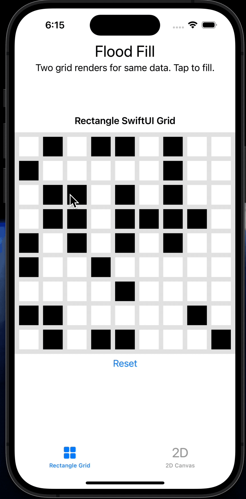

# Rectangle Fill

Flood Fill example using SwiftUI using two methods of rendering and interaction and a recursive fill algorithm.

1. Rectangle SwiftUI Grid - Demonstrates how to create views using `Rectangle` with individual tap gestures.
2. 2D Canvas - Demonstrates how to use the `Canvas` property to draw the grid using shapes and to perform hit detection using a single gesture over the grid.

